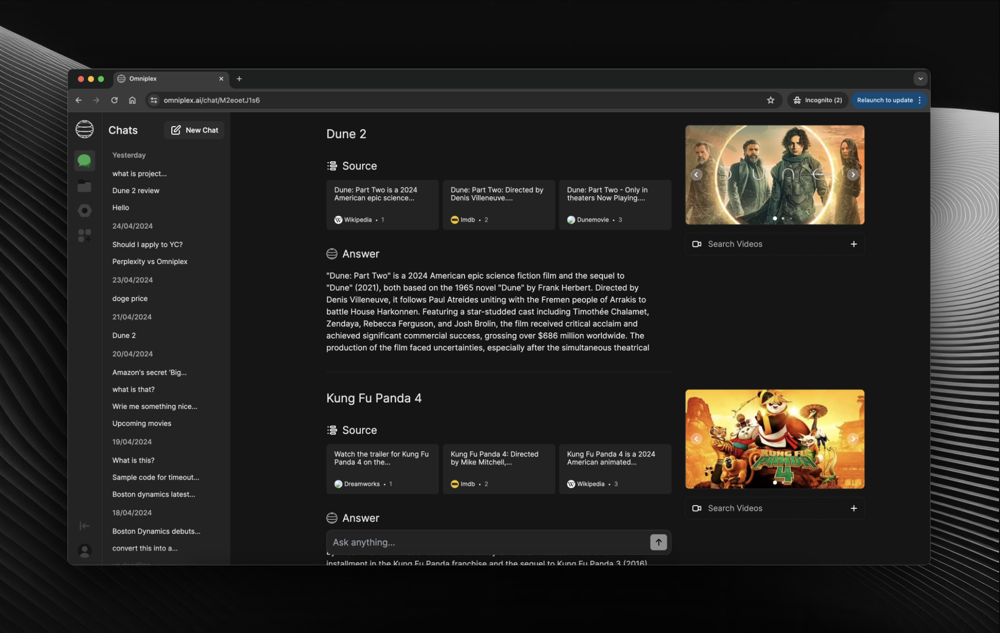

	<h1 align="center"><b>Omniplex</b></h1>

    Open-Source Perplexity
     
     
    <a href="https://omniplex.ai">Website</a>
    ·
    <a href="https://discord.gg/87Mh7q5ZSd">Discord</a>
    ·
    <a href="https://www.reddit.com/r/omniplex_ai">Reddit</a>
  

# :construction: Under Active Development

> Our focus is on establishing core functionality and essential features. As we continue to develop Omniplex, we are committed to implementing best practices, refining the codebase, and introducing new features to enhance the user experience.

# Get started

We are working on the documentation to help you get started with building plugins and addons. For now, to run the project, modify the code in the Chat component to use the `// Development Code`.

## Disclaimer

> We recently transitioned from the pages directory to the app directory, which involved significant changes to the project structure and architecture. As a result, you may encounter some inconsistencies or rough edges in the codebase.

### Roadmap

- [x] Images & Videos for Search
- [x] Upload for Vision Model
- [x] Chat History for Users
- [x] Shared Chats & Fork
- [x] Settings for LLMs
- [x] Custom OG Metadata
- [ ] Function Calling with Generative UI
- [ ] Allow Multiple LLMs
- [ ] Faster API Requests
- [ ] Use Redis & Postgres
- [ ] Plugin Development

### App Architecture

- Language: TypeScript
- Frontend Framework: React
- State Management: Redux
- Web Framework: Next.js
- Backend and Database: Firebase
- UI Library: NextUI
- CSS Framework: TailwindCSS
- AI SDK: Vercel AI SDK

### Services

- LLM: OpenAI
- Search API: Bing
- Hosting & Analytics: Vercel
- Authentication, Storage & Database: Firebase

## Contributing

We welcome contributions from the community! If you'd like to contribute to Openpanel, please follow these steps:

1. Fork the repository
2. Create a new branch for your feature or bug fix
3. Make your changes and commit them with descriptive messages
4. Push your changes to your forked repository
5. Submit a pull request to the main repository

Please ensure that your code follows our coding conventions and passes all tests before submitting a pull request.

## License

This project is licensed under the [AGPL-3.0 license](LICENSE).

## Contact

If you have any questions or suggestions, feel free to reach out to us at [Email](mailto:bishalboss557@gmail.com).

Happy coding! 🚀
